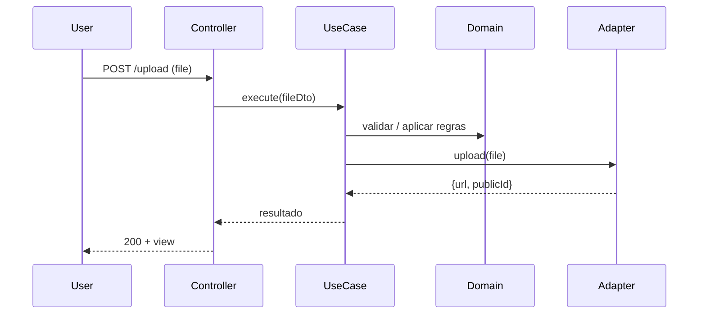

# DDD_SUMMARY — Visão DDD do projeto

Este arquivo resume os README existentes e apresenta diagramas e um walkthrough de alto nível mostrando como o Domain-Driven Design (DDD) foi aplicado neste projeto.

**Sumário rápido**
- **Root**: visão geral e fluxo (HTTP → controller → usecase → domínio → infra). Veja [README.md](README.md#L1).
- **Domain**: regras de negócio, entidades, value objects e contratos (ports). Veja [src/domain/README.md](src/domain/README.md#L1).
- **Data**: casos de uso e orquestração entre domínio e infra. Veja [src/data/README.md](src/data/README.md#L1).
- **Infra**: adaptadores concretos (Cloudinary) que implementam contratos do domínio. Veja [src/infra/README.md](src/infra/README.md#L1).
- **Main**: composição / bootstrap e injeção de dependências. Veja [src/main/README.md](src/main/README.md#L1).
- **Presentation**: controllers, rotas e views (EJS) — camada de interface. Veja [src/presentation/README.md](src/presentation/README.md#L1).

---

**Como o DDD está aplicado aqui (visão condensada)**

- O `domain` contém contratos e regras puras; nada de Express, EJS ou SDKs.
- `infra` contém implementações concretas (adapters) que atendem aos contratos do domínio (ports).
- `data` implementa os casos de uso (application services) que orquestram chamadas entre domínio e infra.
- `presentation` (controllers/rotas) é fino: recebe request, valida e chama casos de uso.
- `main` realiza a composição (injeção de dependências) e inicializa o servidor.

---

**Diagramas (Mermaid)**

Componente geral (camadas):

```mermaid
flowchart TB
  Presentation["Presentation\n(Controllers, Routes, Views)"]
  Data["Data\n(UseCases, Mappers)"]
  Domain["Domain\n(Entities, Contracts, Rules)"]
  Infra["Infra\n(Adapters, SDKs: Cloudinary)"]
  Main["Main\n(Composition / Bootstrap)"]

  Presentation -->|chama| Data
  Data -->|usa contratos| Domain
  Data -->|depende de (injeção)| Infra
  Main -->|injeta| Presentation
  Main -->|injeta| Data
  Main -->|injeta| Infra

  style Domain fill:#f9f,stroke:#333,stroke-width:1px
```

Sequência simplificada de um upload:



---

**Walkthrough de código (alto nível)**

1) Contrato no `domain` (port)

```ts
// src/domain/contracts/IFileStorage.ts
export interface IFileStorage {
  upload(input: Buffer | string): Promise<{ url: string; publicId: string }>;
  delete(publicId: string): Promise<void>;
  list(folder?: string): Promise<Array<{ publicId: string; secureUrl: string; bytes: number; format?: string; resourceType: string }>>;
}
```

2) Adapter em `infra` (implementa o contrato)

```ts
// src/infra/cloudinary/cloudinaryStorageAdapter.ts
import { IFileStorage } from '../../domain/contracts/IFileStorage'
export class CloudinaryStorageAdapter implements IFileStorage {
  async upload(input) {
    // chama cloudinary.uploader.upload e retorna {url, publicId}
  }
  async delete(publicId) {
    // chama cloudinary.uploader.destroy
  }
  async list(folder) {
    // chama a listagem do Cloudinary e retorna os arquivos da pasta
  }
}
```

3) UseCase em `data` (orquestra; usa o contrato)

```ts
// src/data/usecases/upload-file-usecase.ts
import { IFileStorage } from '../../domain/contracts/IFileStorage'

export class UploadFileUseCase {
  constructor(private storage: IFileStorage) {}

  async execute(input) {
    // validar input -> aplicar regras de domínio se necessário
    const res = await this.storage.upload(input.file)
    // mapear resultado para retorno esperado
    return { imageUrl: res.url, id: res.publicId }
  }
}
```

```ts
// src/data/usecases/list-gallery-images/list-gallery-images-usecase.ts
import type { IFileStorage } from '../../domain/contracts/IFileStorage'

export class ListGalleryImagesUseCase {
  constructor(private readonly fileStorage: IFileStorage) {}

  async execute(input = {}) {
    // consulta a listagem do storage, geralmente filtrando por pasta
    return this.fileStorage.list(input.folder)
  }
}
```

4) Controller em `presentation` (fino)

```ts
// src/presentation/controllers/upload-file-controller.ts
export async function uploadFileController(req, res) {
  const input = { file: req.file }
  const result = await uploadFileUseCase.execute(input)
  return res.render('upload-page', { image: result.imageUrl })
}
```

```ts
// src/presentation/controllers/gallery-controller.ts
export async function showGallery(_req, res) {
  const images = await listGalleryImagesUseCase.execute({ folder: 'uploads' })
  return res.render('pages/gallery-page', { title: 'Galeria de imagens', images })
}
```

5) Composição em `main` (injeção)

```ts
// src/main/index.ts
import { CloudinaryStorageAdapter } from '../infra/cloudinary/cloudinaryStorageAdapter'
import { UploadFileUseCase } from '../data/usecases/upload-file-usecase'
import { uploadFileController } from '../presentation/controllers/upload-file-controller'

const storage = new CloudinaryStorageAdapter()
const uploadFileUseCase = new UploadFileUseCase(storage)
// passar uploadFileUseCase para controller (factory ou closure)

// configurar Express, rotas e start server
```

---

**Boas práticas já aplicadas aqui**
- Evitar dependências de infra no `domain`.
- Usar contratos como pontos de troca (test doubles / fakes fáceis).
- Controladores finos e casos de uso testáveis.
- Composição centralizada em `main`.
- O contrato `IFileStorage` cobre upload, delete e listagem, permitindo que a galeria seja montada sem acoplamento ao Cloudinary.

---

**Como usar / testar rapidamente**

Instalar e rodar:

```bash
pnpm install
pnpm start
```

Rodar testes:

```bash
pnpm test
```

---

Se quiser, posso:
- gerar arquivos referenciais de exemplo completos (adapter, usecase, controller e main factory), ou
- renderizar os diagramas em PNG/SVG e incluí-los no repo.
