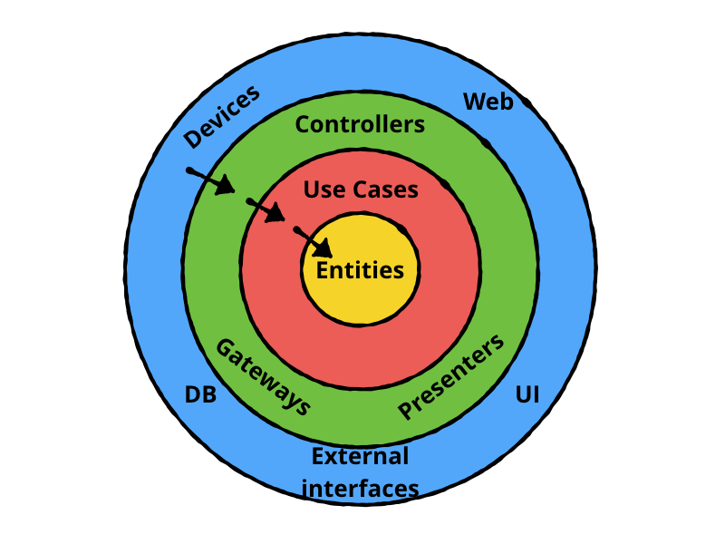

# DDD - Integração com Cloudinary



Este é um projeto para exemplificar a aplicação do DDD (Domain-Driven Design) integrando com o cloudinary, o intuito é mostrar como aplicar o DDD em um projeto real, utilizando uma integração externa para armazenamento de imagens.

## Tecnologias Utilizadas

- Node.js
- Express
- Cloudinary
- TypeScript
- Vitest (para testes)

# Estrutura do Projeto

```
src
├── data
├── domain
├── infra
├── main
├── presentation

```
* **Data**: Repositórios, APIs e manipulação de dados.
* **Domain**: Lógica de negócio e casos de uso.
* **Infra**: Serviços externos e integrações com terceiros.
* **Main**: Inicialização e configuração do projeto.
* **Presentation**: Responsável por lidar com a interface com o usuário na aplicação frontend.
    * Inclui componentes de UI, páginas, rotas, estado de tela e interações do usuário.

## Configuração do Cloudinary

Para configurar o Cloudinary, siga os passos abaixo:
1. Crie uma conta no [Cloudinary](https://cloudinary.com/).
2. Obtenha suas credenciais (Cloud Name, API Key e API Secret).
3. Configure as variáveis de ambiente no seu projeto:

```env
CLOUDINARY_CLOUD_NAME=your_cloud_name
CLOUDINARY_API_KEY=your_api_key 
CLOUDINARY_API_SECRET=your_api_secret
```

## Executando o Projeto

1. Clone o repositório:
```bash
git clone
```

2. Instale as dependências:
```bash
pnpm install
```

3. Inicie o servidor:
```bash
pnpm start
```

## Testes

Para rodar os testes, utilize o comando:
```bash
pnpm test
```